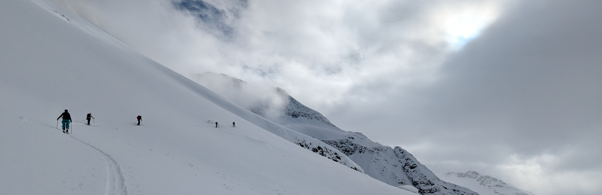

  
  

    February 2025 - Rogers Pass, BC, CA
  

---

  :
  <a href="pages/resume/resume.html">Resume</a>
  :
  <a href="mailto:colindmiddleton@gmail.com">Email</a>
  :
  <a href="https://calendar.google.com/calendar/u/0/appointments/AcZssZ2Iw0lh3uQU7PqLZuOwgWHW61XgVkSWuCBdIwk=?gv=true">Meeting</a>
  :
  <a href="https://www.linkedin.com/in/colin-middleton-000/">LinkedIn</a>
  :
  <a href="https://github.com/middlec000">GitHub</a>
  :

---

## Welcome!
Hello and welcome to my personal website!

I'm Colin Middleton, a data scientist with over three years of combined experience in consulting and healthtech - currently looking for a new mid-to-senior-level role in data science.

## What is a Data Scientist, Anyway?
When I tell other's I'm a Data Scientist, >75% of the time they understandably have no idea what I'm talking about. The term "data scientist" is relatively new and definitely ambiguous because it is an umbrella term that encompasses several better-defined roles. A particular data scientist position is responsible some combination of these roles. Learn more in my page on [Decoding the Data Scientist: A Look at This Evolving Role](pages/data_scientist_role_explained/data_scientist_role_explained.md).

## Interests
### Precision Medicine
Each one of us is different. Different people often present different symptoms for the same illness and respond differently to the same medicine. Precision Medicine is the solution. If we learn what determines these differences and are able to collect that information from patients, care delivery can become much more effective and efficient.

### Negative Socioeconomic Outcome Prevention
Preventing individuals from experiencing negative socioeconomic outcomes such as homelessness is more humane and cost-effective than waiting to assist people only after they have reached the negative outcome, such as losing their homes. See my Predicting Homelessness project below.

### Data Science Tools
I always enjoy learning new tools to help extract, transform, investigate, and visualize data as well as fit models and present findings.

### Outdoors
I currently live in Bellingham, Washington, and enjoy exploring the nearby Cascade Mountains on foot and ski.

## Portfolio
You can click on each of the project headers to visit the GitHub repository for each project.

### [Predicting Homelessness](https://github.com/middlec000/SPA_predict_homelessness)
Used a logistic regression model to predict an individual's risk of experiencing homelessness based on their utility payment history. Published article [here](https://doi.org/10.1371/journal.pone.0292305).

### [The Wordler](https://github.com/middlec000/wordler)
A website that suggests words for you to use for the New York Times Wordle game based on your previous guesses and ranked by user selection of: word frequency, letter frequency, and letter position frequency. Website [here](https://app.hex.tech/60398cd0-c397-4635-a601-971b1bb7d7d2/app/bdb69a0f-db3f-426f-ac4b-5e72c89cdd8a/latest?).

### [One-Way ANOVA Website](https://github.com/middlec000/grades_vs_student_characteristic)
Upload your data, group it by a categorical column, then determine if there is a statistically significant difference in means of a continuous variable between groups. Example provided. Website [here](https://share.streamlit.io/middlec000/grades_vs_student_characteristic/main/src/main.py).

### [Wine Quality Classification](https://github.com/middlec000/wine_quality)
Used a random forest model to classify wine into one of six quality rankings based on given attributes.

## Education
- MS Applied Mathematics (June 2021)
  - Eastern Washington University
  - 4.0 GPA
  - Outstanding Graduate Award
  - Graduate Service Appointment
- BS Mathematics (December 2017)
  - Western Washington University
  - 3.5 GPA
  - Chemistry Minor
  - Math Fellow
  - Honors Program
  - Presidential Scholarship Recipient

  
  

    October 2024 - Moab, UT, USA
  

