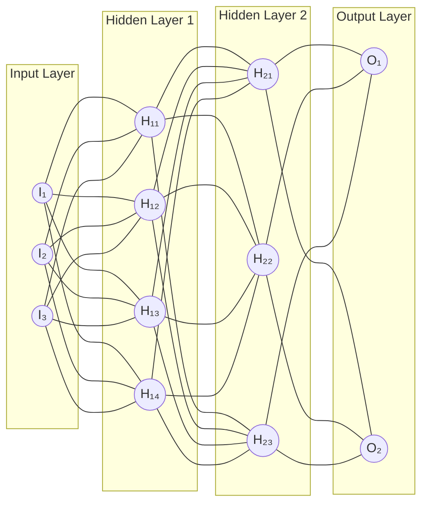
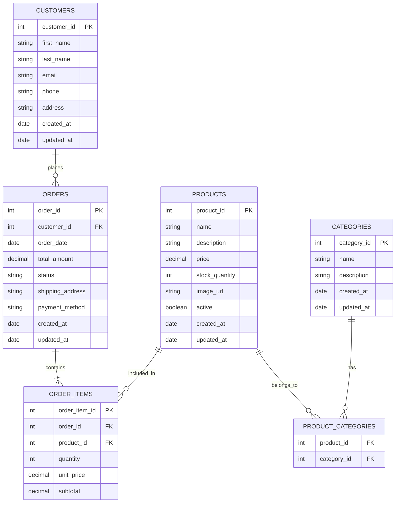

# Decoding the Data Scientist: A Look at This Evolving Role

## Introduction

The term "data scientist" has become increasingly prevalent in recent years, often hailed as a pivotal role in modern organizations. However, for those outside the field, understanding exactly what a data scientist does can be a challenging task. This article aims to demystify this relatively new profession, exploring its origins, the reasons behind its often ambiguous definition, and the various specialized roles that fall under its umbrella [1].  

While the term "data science" might sound contemporary, its roots can be traced back several decades. Some early mentions appeared in the 1960s, sometimes used as an alternative to statistics [2]. Peter Naur used the term in his 1974 publication, defining it as the application of data and data processes in building and handling models of reality [1]. In 1997, C. F. Jeff Wu suggested that statistics should be renamed data science to better reflect its evolving nature beyond just describing data [5]. However, it wasn't until the early 21st century that "data science" solidified as a distinct profession, driven by the increasing availability of large and complex datasets, often referred to as "big data" [1]. The rise of the internet and advancements in technology have led to an explosion of data, creating a need for professionals who can extract meaningful insights from this vast information [3].  

One of the first things to understand about the title "data scientist" is that it is a relatively new and broadly defined term [1]. Unlike more established roles with clear boundaries, the responsibilities of a data scientist can vary significantly depending on the organization, industry, and specific needs [9]. This ambiguity stems from the interdisciplinary nature of the field, which draws upon elements of statistics, computer science, mathematics, and domain-specific knowledge [5]. The rapid evolution of technology and the ever-increasing amounts of data mean that the role of a data scientist is still taking shape [8]. This lack of a rigid definition can sometimes lead to confusion, as different companies might use the same title to describe roles with vastly different responsibilities [8].  

Despite the general nature of the title, the work that falls under "data science" typically involves a systematic process of extracting knowledge and insights from data to inform decision-making [6]. This often includes several key stages: obtaining data from various sources, cleaning and preparing the data for analysis, exploring the data to identify patterns and trends, building models to make predictions or classifications, and communicating the findings to stakeholders in a clear and understandable way [6]. Data scientists utilize a variety of tools and techniques, including programming languages like Python and R, statistical methods, machine learning algorithms, and data visualization software [7].  

Given the breadth of skills and responsibilities associated with the general title of data scientist, it often encompasses several more specific roles. Understanding these distinctions can provide a clearer picture of the different types of work involved in the field. Below are some common specific roles that a "data scientist" will perform.

## Constituent Roles

### 1\. Data Analyst
Often considered a foundational role, a data analyst focuses on interpreting existing data to identify trends, patterns, and insights that can help organizations make better decisions [10]. They work with structured data, often using tools like SQL and Excel to query and manipulate datasets [17]. Data analysts are skilled at data visualization, creating charts and graphs to communicate their findings to both technical and non-technical audiences [2].

  
  

   Example of a data dashboard.
  

Typical Tasks:  
  * Gathering data from various sources, such as databases, surveys, and web analytics [14]. For example, a data analyst might collect website traffic data to understand user behavior [17].  
  * Cleaning and preparing data by handling missing values, correcting errors, and ensuring consistency [6]. This might involve formatting dates or standardizing text entries [6].  
  * Performing exploratory data analysis (EDA) to understand the data's characteristics and identify potential areas for further investigation [6]. This could involve calculating summary statistics or creating initial visualizations [13].  
  * Analyzing data using statistical techniques to identify trends, correlations, and anomalies [13]. For instance, a retail data analyst might analyze sales data to identify top-selling products [14].  
  * Creating reports and dashboards to present findings and insights to stakeholders [10]. This could involve using tools like Tableau or Power BI to create interactive visualizations [14].  
  * Collaborating with business teams to understand their data needs and provide data-driven recommendations [13]. A data analyst might work with the marketing team to understand the effectiveness of different campaigns [16].

### 2\. Machine Learning Engineer
This role focuses on building and deploying machine learning models that can automate tasks, make predictions, or provide recommendations [10]. Machine learning engineers have a strong background in computer programming and are skilled in implementing machine learning algorithms using various frameworks and libraries [27]. They work closely with data scientists to take models from research to production [23].

Example of the internal structure of a machine learning model.

Typical Tasks:  
  * Designing and developing machine learning systems and algorithms [26]. This might involve selecting the appropriate algorithm for a specific problem, such as using a classification algorithm for image recognition [20].  
  * Building data pipelines to feed data into machine learning models [10]. This includes collecting, cleaning, and transforming data to be suitable for model training [27].  
  * Training and evaluating machine learning models using large datasets [2]. For example, training a model to predict customer churn based on historical customer data [31].  
  * Optimizing model performance by tuning hyperparameters and experimenting with different architectures [13]. This ensures the model is accurate and efficient [20].  
  * Deploying machine learning models into production environments so they can be used by applications and systems [13]. This could involve integrating a fraud detection model into a banking application [7].  
  * Monitoring and maintaining deployed models to ensure they continue to perform well over time [13]. This includes retraining models with new data as needed [28].

### 3\. Data Engineer
Data engineers are responsible for building and maintaining the infrastructure that allows data to be collected, stored, and processed efficiently [10]. They focus on the "plumbing" of data, ensuring that data is readily available and in the right format for data scientists and analysts to use [12]. They often work with large-scale data systems and cloud technologies [32].

Typical Extract, Transform, and Load (ETL) process diagram.

Typical Tasks:  
  * Designing and building data pipelines for extracting, transforming, and loading (ETL) data from various sources into data warehouses or data lakes [10]. For example, creating a pipeline to move customer transaction data from a database to a data warehouse for analysis [32].  
  * Developing and maintaining data storage solutions, including databases, data warehouses, and data lakes [32]. This involves choosing the right technology for the organization's needs [32].  
  * Ensuring data quality and integrity by implementing data validation and monitoring processes [32]. This helps to ensure that the data used for analysis is accurate and reliable [32].  
  * Optimizing data infrastructure for performance and scalability to handle growing data volumes [32]. This ensures that the systems can handle large amounts of data without slowing down [32].  
  * Working with big data technologies like Hadoop and Spark to process and analyze large datasets [2]. These tools allow for the efficient processing of massive amounts of information [6].  
  * Automating data-related tasks and processes using scripting and other tools [20]. This helps to improve efficiency and reduce manual errors [32].

### 4\. Data Architect
A data architect focuses on the overall strategy for how data will be stored, managed, and used within an organization [10]. They design the blueprint for the data infrastructure, considering factors like data security, data governance, and future scalability [10]. They often work at a higher level than data engineers, focusing on the strategic vision for data management [42].

Example of the design of a database schema.

Typical Tasks:  
  * Developing data models and database schemas to represent the organization's data assets [18]. This involves defining the structure and relationships between different data elements [43].  
  * Defining data standards and policies to ensure data quality, consistency, and security [41]. This helps to maintain the integrity and usability of the data [43].  
  * Designing the overall data architecture, including data warehouses, data lakes, and other data storage systems [18]. This involves selecting the appropriate technologies and designing how they will work together [45].  
  * Ensuring compliance with data governance regulations and best practices [33]. This is crucial for protecting sensitive information and meeting legal requirements [43].  
  * Collaborating with business stakeholders to understand their data needs and translate them into technical requirements [23]. This ensures that the data architecture supports the organization's business goals [43].  
  * Planning and overseeing data migration projects when transitioning to new systems or platforms [45]. This involves ensuring a smooth and accurate transfer of data [45].

### 5\. Business Intelligence Analyst
While sometimes considered a separate field, the work of a business intelligence (BI) analyst often overlaps with that of a data scientist, particularly in terms of analyzing data to provide business insights [18]. BI analysts typically focus on using data to understand past and present business performance and identify areas for improvement [18].

  
  

   Business intelligence value chain.
  

Typical Tasks:  
  * Collecting and analyzing business data from various sources, such as sales figures, customer databases, and market research [46]. For example, a BI analyst might analyze sales data to understand which products are performing best in different regions [47].  
  * Developing and maintaining BI dashboards and reports to track key performance indicators (KPIs) and business metrics [18]. These dashboards provide a visual overview of business performance [47].  
  * Identifying trends and patterns in business data to uncover opportunities for process optimization and data-driven decision-making [46]. This could involve analyzing customer behavior to identify potential areas for new product development [47].  
  * Collaborating with stakeholders to understand their analytical requirements and deliver relevant insights [23]. A BI analyst might work with the finance team to create reports on financial performance [46].  
  * Conducting data quality checks to ensure the accuracy and reliability of business intelligence information [48]. This is crucial for making informed business decisions [47].  
  * Providing technical support for BI tools and systems [46]. This ensures that users can effectively access and utilize the available data and reports [46].

## Summary

In conclusion, the role of a data scientist is a multifaceted one, often acting as an umbrella term for various specialized roles centered around the extraction of knowledge and insights from data. While the title itself can be new, general, and poorly defined, understanding the specific roles it encompasses, such as data analyst, machine learning engineer, data engineer, data architect, and business intelligence analyst, provides a clearer picture of the diverse work involved in this rapidly evolving field [9]. As organizations continue to generate and rely on increasing amounts of data, the demand for professionals with these skills will only continue to grow [20].

# My Data Science Focus: Where I Fit into the Data Science Landscape

Throughout my career, I've developed expertise across several key domains within the broader data science field. My experience reflects the multidisciplinary nature of data science discussed above, with particular depth in the following areas:

## Predictive Modeling and Statistical Analysis

My work at Pearl Health demonstrates my expertise in developing sophisticated forecasting models using techniques ranging from classical time series methods (exponential smoothing, theta modeling) to multivariate regression. This experience spans both the statistician and data scientist roles, applying rigorous statistical methodology to real-world healthcare operational challenges.

My published research on homelessness prediction further showcases my capabilities in evaluating diverse predictive algorithms including logistic regression, neural networks, and survival analysis models (Cox Proportional Hazards). Addressing extreme class imbalance through minority oversampling demonstrates my ability to handle complex machine learning challenges that require both technical skill and domain understanding.

## Data Engineering and Pipeline Development

While my primary focus has been on analysis and modeling, I've developed substantial data engineering capabilities. My work architecting enterprise-grade data ingestion and versioning pipelines demonstrates how data scientists often need to build the infrastructure that enables their analytical work. The comprehensive tracking system I designed for pricing tool inputs represents the operational data systems that bridge raw data and actionable insights.

My experience refactoring mission-critical codebases (12k+ lines of Python) and engineering proprietary I/O systems that significantly improved input accuracy shows my commitment to creating robust, maintainable data infrastructure—skills typically associated with the data engineering domain.

## Business Analytics and Communication

A significant portion of my work has involved translating complex technical concepts into actionable business insights. Leading individualized analyses for strategic prospects and developing comprehensive tracking systems for sales funnel optimization demonstrates my ability to function as a business analyst, connecting data insights to organizational decision-making.

My experience presenting research findings to the Spokane City Council highlights my capability to communicate technical results to non-technical stakeholders—a crucial skill that spans all data science roles.

## Tool Development and Optimization

Throughout my career, I've consistently focused on building and optimizing tools that transform data into utility. From migrating client reporting tools from SAS to Python (achieving a 10x runtime improvement) to developing The Wordler application and contributing to customized algorithms for document clustering, I've demonstrated versatility in creating practical data applications.

---

My experience illustrates how modern data scientists often need to operate across traditional role boundaries, developing capabilities that span from engineering to communication. While my strongest technical skills are in statistical modeling and predictive analytics, I've cultivated the breadth necessary to deliver end-to-end data solutions in complex environments.

# Credit

I largely used Google's [Gemini](https://gemini.google.com) (Deep Research) and Anthropic's [Claude](https://claude.ai) (3.7 Sonnet) to write this article for me and to generate all the graphics. I acted as editor.

# Sources

1. The History Of Data Science and Pioneers You Should Know | Worcester Polytechnic Institute, accessed March 19, 2025, [https://onlinestemprograms.wpi.edu/blog/history-data-science-and-pioneers-you-should-know](https://onlinestemprograms.wpi.edu/blog/history-data-science-and-pioneers-you-should-know)  
2. What is Data Science? \- AWS, accessed March 19, 2025, [https://aws.amazon.com/what-is/data-science/](https://aws.amazon.com/what-is/data-science/)  
3. A Brief History of Data Science \- DATAVERSITY, accessed March 19, 2025, [https://www.dataversity.net/brief-history-data-science/](https://www.dataversity.net/brief-history-data-science/)  
4. onlinestemprograms.wpi.edu, accessed March 19, 2025, [https://onlinestemprograms.wpi.edu/blog/history-data-science-and-pioneers-you-should-know\#:\~:text=1974,and%20handling%20models%20of%20reality.%22](https://onlinestemprograms.wpi.edu/blog/history-data-science-and-pioneers-you-should-know#:~:text=1974,and%20handling%20models%20of%20reality.%22)  
5. Data science \- Wikipedia, accessed March 19, 2025, [https://en.wikipedia.org/wiki/Data\_science](https://en.wikipedia.org/wiki/Data_science)  
6. What Is Data Science? Definition, Skills, Applications & More, accessed March 19, 2025, [https://seas.harvard.edu/news/what-data-science-definition-skills-applications-more](https://seas.harvard.edu/news/what-data-science-definition-skills-applications-more)  
7. What Is Data Science? Definition, Tools, Techniques, & More, accessed March 19, 2025, [https://ischool.syracuse.edu/what-is-data-science/](https://ischool.syracuse.edu/what-is-data-science/)  
8. Overcoming Some of the Worst Parts of Being a Data Scientist | Towards Data Science, accessed March 19, 2025, [https://towardsdatascience.com/overcoming-some-of-the-worst-parts-of-being-a-data-scientist-3237d20f356f/](https://towardsdatascience.com/overcoming-some-of-the-worst-parts-of-being-a-data-scientist-3237d20f356f/)  
9. Hiring a Data Scientist: Decoding the Ambiguities \- Datahut Blog, accessed March 19, 2025, [https://www.blog.datahut.co/post/hiring-a-data-scientist-decoding-the-ambiguities](https://www.blog.datahut.co/post/hiring-a-data-scientist-decoding-the-ambiguities)  
10. 12 Data Science Job Titles — Which Role Is Right for You? \- Built In, accessed March 19, 2025, [https://builtin.com/data-science/data-science-jobs](https://builtin.com/data-science/data-science-jobs)  
11. The ambiguity of data science team roles and the need for a data science workforce framework | Request PDF \- ResearchGate, accessed March 19, 2025, [https://www.researchgate.net/publication/322512207\_The\_ambiguity\_of\_data\_science\_team\_roles\_and\_the\_need\_for\_a\_data\_science\_workforce\_framework](https://www.researchgate.net/publication/322512207_The_ambiguity_of_data_science_team_roles_and_the_need_for_a_data_science_workforce_framework)  
12. seas.harvard.edu, accessed March 19, 2025, [https://seas.harvard.edu/news/what-data-science-definition-skills-applications-more\#:\~:text=Data%20science%20and%20engineering%20also,use%20them%20for%20decision%2Dmaking.](https://seas.harvard.edu/news/what-data-science-definition-skills-applications-more#:~:text=Data%20science%20and%20engineering%20also,use%20them%20for%20decision%2Dmaking.)  
13. What is a Data Scientist and How Can You Succeed in This Field? \- News@TheU, accessed March 19, 2025, [https://news.miami.edu/uonline/stories/2024/07/what-is-a-data-scientist.html](https://news.miami.edu/uonline/stories/2024/07/what-is-a-data-scientist.html)  
14. What Does a Data Analyst Do? Roles, Skills & Tools Explained, accessed March 19, 2025, [https://ischool.syracuse.edu/what-does-a-data-analyst-do/](https://ischool.syracuse.edu/what-does-a-data-analyst-do/)  
15. What Does a Data Analyst Do? Roles, Skills, and Salary, accessed March 19, 2025, [https://graduate.northeastern.edu/knowledge-hub/what-does-a-data-analyst-do/](https://graduate.northeastern.edu/knowledge-hub/what-does-a-data-analyst-do/)  
16. What Does a Data Analyst Do? | SNHU, accessed March 19, 2025, [https://www.snhu.edu/about-us/newsroom/stem/what-does-a-data-analyst-do](https://www.snhu.edu/about-us/newsroom/stem/what-does-a-data-analyst-do)  
17. What Does a Data Analyst Do? Your 2025 Career Guide \- Coursera, accessed March 19, 2025, [https://www.coursera.org/articles/what-does-a-data-analyst-do-a-career-guide](https://www.coursera.org/articles/what-does-a-data-analyst-do-a-career-guide)  
18. 8 Key Data Science Roles Explained, accessed March 19, 2025, [https://365datascience.com/career-advice/types-of-data-science-roles-explained/](https://365datascience.com/career-advice/types-of-data-science-roles-explained/)  
19. Data analyst job profile | Prospects.ac.uk, accessed March 19, 2025, [https://www.prospects.ac.uk/job-profiles/data-analyst](https://www.prospects.ac.uk/job-profiles/data-analyst)  
20. Data Scientists : Occupational Outlook Handbook \- Bureau of Labor Statistics, accessed March 19, 2025, [https://www.bls.gov/ooh/math/data-scientists.htm](https://www.bls.gov/ooh/math/data-scientists.htm)  
21. 5 Data Analytics Projects for Beginners \- Coursera, accessed March 19, 2025, [https://www.coursera.org/articles/data-analytics-projects-for-beginners](https://www.coursera.org/articles/data-analytics-projects-for-beginners)  
22. The Roles and Responsibilities of a Data Analyst | Pecan AI, accessed March 19, 2025, [https://www.pecan.ai/blog/the-roles-and-responsibilities-of-a-data-analyst/](https://www.pecan.ai/blog/the-roles-and-responsibilities-of-a-data-analyst/)  
23. Key Insights on 7 Data Science Roles, Responsibilities and Skills, accessed March 19, 2025, [https://und.edu/blog/data-science-roles-and-responsibilities.html](https://und.edu/blog/data-science-roles-and-responsibilities.html)  
24. 11 Data Science Careers That Are Shaping the Future, accessed March 19, 2025, [https://graduate.northeastern.edu/knowledge-hub/data-science-careers-shaping-our-future/](https://graduate.northeastern.edu/knowledge-hub/data-science-careers-shaping-our-future/)  
25. www.run.ai, accessed March 19, 2025, [https://www.run.ai/guides/machine-learning-engineering\#:\~:text=Machine%20learning%20engineers%20build%20software,in%20production%20and%20at%20scale.](https://www.run.ai/guides/machine-learning-engineering#:~:text=Machine%20learning%20engineers%20build%20software,in%20production%20and%20at%20scale.)  
26. What Is a Machine Learning Engineer? (+ How to Get Started) \- Coursera, accessed March 19, 2025, [https://www.coursera.org/articles/what-is-machine-learning-engineer](https://www.coursera.org/articles/what-is-machine-learning-engineer)  
27. What is a Machine Learning Engineer? The Ultimate Guide \- NVIDIA Run:ai, accessed March 19, 2025, [https://www.run.ai/guides/machine-learning-engineering](https://www.run.ai/guides/machine-learning-engineering)  
28. What Is a Machine Learning Engineer? (2025 Guide) \- BrainStation, accessed March 19, 2025, [https://brainstation.io/career-guides/what-is-a-machine-learning-engineer](https://brainstation.io/career-guides/what-is-a-machine-learning-engineer)  
29. Machine Learning Engineer Job Description \- LinkedIn Business, accessed March 19, 2025, [https://business.linkedin.com/talent-solutions/resources/how-to-hire-guides/machine-learning-engineer/job-description](https://business.linkedin.com/talent-solutions/resources/how-to-hire-guides/machine-learning-engineer/job-description)  
30. Machine Learning Engineer Job Description: A Complete Guide \- Caltech Bootcamps, accessed March 19, 2025, [https://pg-p.ctme.caltech.edu/blog/ai-ml/machine-learning-engineer-job-description](https://pg-p.ctme.caltech.edu/blog/ai-ml/machine-learning-engineer-job-description)  
31. 100+ Machine Learning Projects with Source Code \[2025\] \- GeeksforGeeks, accessed March 19, 2025, [https://www.geeksforgeeks.org/machine-learning-projects/](https://www.geeksforgeeks.org/machine-learning-projects/)  
32. What is a Data Engineer? \- Splunk, accessed March 19, 2025, [https://www.splunk.com/en\_us/blog/learn/data-engineer-role-responsibilities.html](https://www.splunk.com/en_us/blog/learn/data-engineer-role-responsibilities.html)  
33. What Is a Data Engineer? A Guide to This In-Demand Career | Coursera, accessed March 19, 2025, [https://www.coursera.org/articles/what-does-a-data-engineer-do-and-how-do-i-become-one](https://www.coursera.org/articles/what-does-a-data-engineer-do-and-how-do-i-become-one)  
34. Working as a data engineer | Randstad USA, accessed March 19, 2025, [https://www.randstadusa.com/job-seeker/career-advice/job-profiles/data-engineer/](https://www.randstadusa.com/job-seeker/career-advice/job-profiles/data-engineer/)  
35. Data Engineer Roles and Responsibilities, Salaries and Jobs | Randstad, accessed March 19, 2025, [https://www.randstad.com/career-advice/careers/data-engineer/](https://www.randstad.com/career-advice/careers/data-engineer/)  
36. Data engineer \- Government Digital and Data Profession Capability Framework, accessed March 19, 2025, [https://ddat-capability-framework.service.gov.uk/role/data-engineer](https://ddat-capability-framework.service.gov.uk/role/data-engineer)  
37. Data Engineer Job Description \- Virginia Office of Data Governance and Analytics, accessed March 19, 2025, [https://www.odga.virginia.gov/media/governorvirginiagov/chief-data-officer/css/Job-Description---Data-Engineer-Sample.pdf](https://www.odga.virginia.gov/media/governorvirginiagov/chief-data-officer/css/Job-Description---Data-Engineer-Sample.pdf)  
38. Key Data Engineer Skills and Responsibilities \- Simplilearn.com, accessed March 19, 2025, [https://www.simplilearn.com/data-engineer-role-article](https://www.simplilearn.com/data-engineer-role-article)  
39. Top 10 Data Engineering Projects for 2025 \- Simplilearn.com, accessed March 19, 2025, [https://www.simplilearn.com/tutorials/big-data-tutorial/data-engineering-projects](https://www.simplilearn.com/tutorials/big-data-tutorial/data-engineering-projects)  
40. www.splunk.com, accessed March 19, 2025, [https://www.splunk.com/en\_us/blog/learn/data-engineer-role-responsibilities.html\#:\~:text=A%20data%20engineer's%20primary%20responsibility,writing%20code%20for%20required%20customizations.](https://www.splunk.com/en_us/blog/learn/data-engineer-role-responsibilities.html#:~:text=A%20data%20engineer's%20primary%20responsibility,writing%20code%20for%20required%20customizations.)  
41. Data Architect \- Texas State Auditor's Office, accessed March 19, 2025, [https://hr.sao.texas.gov/Compensation/JobDescriptions/R0317.pdf](https://hr.sao.texas.gov/Compensation/JobDescriptions/R0317.pdf)  
42. What Does a Data Architect Do? A Career Guide \- Coursera, accessed March 19, 2025, [https://www.coursera.org/articles/data-architect](https://www.coursera.org/articles/data-architect)  
43. What is a Data Architect? Responsibilities, Skills & Salary Explored | Splunk, accessed March 19, 2025, [https://www.splunk.com/en\_us/blog/learn/data-architect-role-responsibilities.html](https://www.splunk.com/en_us/blog/learn/data-architect-role-responsibilities.html)  
44. Data architect \- Government Digital and Data Profession Capability Framework, accessed March 19, 2025, [https://ddat-capability-framework.service.gov.uk/role/data-architect](https://ddat-capability-framework.service.gov.uk/role/data-architect)  
45. Data Architect Roles & Responsibilities Guide for 2025 \- Atlan, accessed March 19, 2025, [https://atlan.com/data-architect-roles-and-responsibilities/](https://atlan.com/data-architect-roles-and-responsibilities/)  
46. 15-2051.01 \- Business Intelligence Analysts \- O\*NET, accessed March 19, 2025, [https://www.onetonline.org/link/summary/15-2051.01](https://www.onetonline.org/link/summary/15-2051.01)  
47. A Day in the Life of a Business Intelligence Analyst, accessed March 19, 2025, [https://post.edu/blog/a-day-in-the-life-of-a-business-intelligence-analyst/](https://post.edu/blog/a-day-in-the-life-of-a-business-intelligence-analyst/)  
48. Business Intelligence Analyst Job Description and Templates \- Thoughts about Product Adoption, User Onboarding and Good UX | Userpilot Blog, accessed March 19, 2025, [https://userpilot.com/blog/business-intelligence-analyst-job-description/](https://userpilot.com/blog/business-intelligence-analyst-job-description/)  
49. Example Job Description for Business Intelligence Analyst \- Yardstick, accessed March 19, 2025, [https://www.yardstick.team/job-description/business-intelligence-analyst](https://www.yardstick.team/job-description/business-intelligence-analyst)  
50. Business Intelligence Analyst Job Description \- Deel, accessed March 19, 2025, [https://www.deel.com/job-description-templates/business-intelligence-analyst](https://www.deel.com/job-description-templates/business-intelligence-analyst)