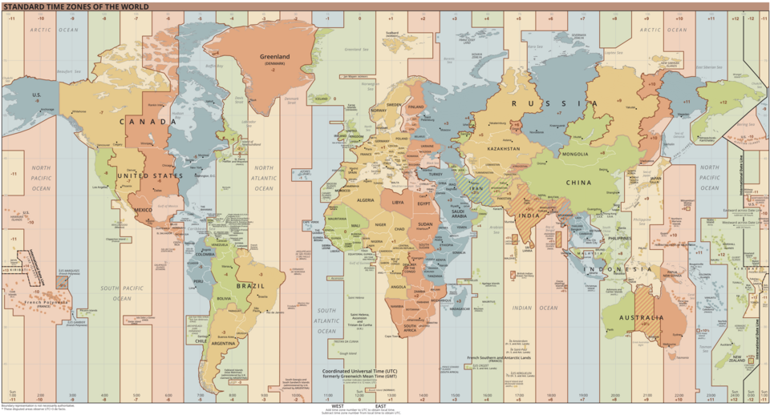

  
  

    World Time Zones Map. <a href="https://en.wikipedia.org/wiki/File:World_Time_Zones_Map.png">Source</a>
  

---

# Why Everyone Should Use UTC with Region-Specific Business Hours

## What is UTC?

Coordinated Universal Time (UTC) is the current global standard clock that all timezone-specific clocks are based on. Digital devices already use UTC under the hood by tracking time in UTC, then calculating the local time by adding or subtracting a certain number of hours determined by your time zone. Almost all people use the timezone-specific clock time, not UTC.

If you want more history, [here](https://en.wikipedia.org/wiki/Coordinated_Universal_Time) is the Wikipedia page.

## Motivation

I work remotely for a company headquartered in a timezone with a 3 hour difference from my own. My fellow coworkers are spread across the globe, some with a 13 hour time difference. Every time I want to schedule a meeting with someone outside of our digital calendar, we have to specify which timezone we are using as the reference and do mental math each time we go back and forth proposing different times. Admittedly this is not much effort, but it adds up over everyone communicating with anyone else in a different time zone. There is also a high risk of miscommunication if someone forgets to reference the timezone - did you mean your time or mine?

## Proposed New System

I, along with many others, think everyone should use UTC. I add a few additional details here that I have not seen others discuss in an attempt to ease the transition from current state to future state and to fill a few gaps in a UTC-only system.

The system I propose is this:

1. In situations where a specific time is needed, use UTC.
1. In situations where a convenient time for someone must be assumed, use a business hours or daylight hours lookup table (stored in UTC).
1. In situations where time is used as a cultural or contextual cue, use the cultural or contextual cue directly.

## Argument

To convince you to use this new system, I will compare the currently widespread timezone method of tracking and communicating about time to this new system within each type of situation outlined above. In each case, the new method is at least as good as the current method. By "good" I mean easier and clearer. I will present the general points and then give some examples.

### Specific Time Needed

This category includes all situations where a specific time is being communicated and no assumptions about what is convenient for others need to be made.

#### Point 1: UTC is more Efficient

UTC requires less effort/information when specifying a time across timezones and requires the same amount within a timezone.

| Example | Situation         | Conventional                                         | Proposed                     | Explanation                                                                                |
| ------- | ----------------- | ---------------------------------------------------- | ---------------------------- | ------------------------------------------------------------------------------------------ |
| 1       | Across Timezones  | Let's meet at 17:00, <timezone-specifier>, on day X. | Let's meet at 8:00 on Day X. | You must specify a timezone to be precise when communicating with the conventional system. |
| 2       | Within a Timezone | Let's meet at 17:00.                                 | Let's meet at 8:00.          | Same amount of information required.                                                       |

#### Point 2: UTC is less Risky

UTC is more difficult to get wrong, meaning it's lower risk. Using the conventional system can easily result in miscommunication when communicating across timezones or around daylight savings clock changes.

| Example | Situation                                             | Conventional                  | Proposed                     | Explanation                                                                                                          |
| ------- | ----------------------------------------------------- | ----------------------------- | ---------------------------- | -------------------------------------------------------------------------------------------------------------------- |
| 1       | Across Timezones                                      | Let's meet at 17:00.          | Let's meet at 8:00.          | If a timezone is not specified using the conventional system, the time could be any of the participants' local time. |
| 2       | A Daylight Savings Time Change will Occur at Midnight | Let's meet at 17:00 tomorrow. | Let's meet at 8:00 tomorrow. | UTC does not change with daylight savings - it is standard for everyone.                                             |

### Assume Convenient Time

This category includes all situations where one party must assume a reasonable or convenient time for another party, without explicitly negotiating it. Examples include scheduling an automated notification, deciding when to send an email, or picking a delivery window.

#### Point 1: A Lookup Table Makes Assumptions Explicit and Standard

With a UTC-based business hours or daylight hours lookup table indexed by region, anyone can determine a reasonable time for another party without needing to know or mentally convert timezone offsets.

| Example | Situation                                   | Conventional                                                                             | Proposed                                                                | Explanation                                                                                      |
| ------- | ------------------------------------------- | ---------------------------------------------------------------------------------------- | ----------------------------------------------------------------------- | ------------------------------------------------------------------------------------------------ |
| 1       | Schedule a delivery for business hours      | Send it between 9–5 in their local timezone (must know or store their timezone).         | Look up the region's business hours in UTC; schedule within that range. | The UTC table centralizes timezone knowledge — the sender doesn't need to calculate or store it. |
| 2       | Send an automated email during waking hours | Schedule for 10:00 AM their local time (requires storing and applying their UTC offset). | Look up the region's daylight hours in UTC; schedule accordingly.       | Eliminates per-user timezone offset logic; one shared reference table is sufficient.             |

#### Point 2: A UTC Lookup Table Handles Daylight Saving Time Automatically

Because the lookup table is maintained in UTC and updated when regions change their clocks, callers never need to account for DST transitions themselves.

| Example | Situation                                           | Conventional                                                                          | Proposed                                                                          | Explanation                                                              |
| ------- | --------------------------------------------------- | ------------------------------------------------------------------------------------- | --------------------------------------------------------------------------------- | ------------------------------------------------------------------------ |
| 1       | Recurring automated job around a DST change         | Must update stored UTC offsets for affected regions when clocks change; easy to miss. | Update the lookup table in one place; all callers benefit automatically.          | Maintenance burden is centralized rather than duplicated across systems. |
| 2       | Estimating whether a colleague is in their work day | Must know their current UTC offset, which changes twice a year for many regions.      | Query the table: it always reflects current business hours in UTC for the region. | The lookup abstracts away the DST complexity entirely.                   |

### Contextual Cue

This category covers situations where time is communicated in relative or cultural terms.

#### Point 1: Use Relative Terms Directly

Phrases like "after lunch," "in the morning," or "during the holidays." These references are inherently tied to a person's local context and do not require a specific clock time at all.

In these cases, the proposed system makes no change: use the contextual cue directly. UTC neither helps nor hinders here.

| Example | Situation                          | Conventional                        | Proposed                            | Explanation                                                                      |
| ------- | ---------------------------------- | ----------------------------------- | ----------------------------------- | -------------------------------------------------------------------------------- |
| 1       | Suggesting an informal meeting     | "Let's grab coffee in the morning." | "Let's grab coffee in the morning." | Contextual cues are location-relative by nature; no clock time is needed.        |
| 2       | Coordinating around a shared event | "Call me after dinner."             | "Call me after dinner."             | The reference is self-anchoring; both parties share the same cultural context.   |
| 3       | Seasonal reference                 | "We'll launch before the holidays." | "We'll launch before the holidays." | Cultural markers implicitly carry local meaning that a UTC timestamp cannot add. |

#### Point 2: Cultural Events use UTC Derived from Daylight or Workday Hours

Some cultural events are scheduled at a specific local clock time — midnight on New Year's Eve, a noon bell, a 17:00 happy hour — but those clock times were not chosen arbitrarily. They were originally grounded in natural or social phenomena: midnight is the middle of the night, noon is the sun at its peak, and 17:00 marks the end of the workday. These phenomena are best captured in UTC through the same daylight hours and business hours lookup table described above, not through a fixed local clock time.

The problem with using a fixed local clock time is that Daylight Saving Time detaches the clock from the underlying phenomenon. A New Year's countdown "at midnight" under DST is an hour off from the astronomical midpoint of darkness. Noon on the clock may not closely correspond to solar noon. The proposal here is to anchor these culturally significant times to the UTC equivalent of the natural or social event they represent, using the regional lookup table, rather than preserving an arbitrary clock number that DST has already shifted away from the original meaning.

| Example | Situation                              | Conventional                                                                    | Proposed                                                                                                                   | Explanation                                                                                                    |
| ------- | -------------------------------------- | ------------------------------------------------------------------------------- | -------------------------------------------------------------------------------------------------------------------------- | -------------------------------------------------------------------------------------------------------------- |
| 1       | New Year's countdown                   | Celebrated at 00:00 local clock time, which shifts with DST.                    | Celebrate at the UTC time corresponding to the midpoint of darkness for the region (from the daylight hours lookup table). | Preserves the original intent — the middle of the night — better than a clock number that DST has shifted.     |
| 2       | Noon bell / midday broadcast           | Broadcast at 12:00 local clock time, which does not track solar noon under DST. | Air at the UTC time corresponding to the midpoint of the region's daylight hours.                                          | Solar noon, the origin of the tradition, is a daylight-hours concept; the lookup table captures it accurately. |
| 3       | End-of-workday cultural marker (17:00) | Observed at 17:00 local clock time.                                             | Observe at the UTC time corresponding to the end of business hours for the region (from the business hours lookup table).  | Ties the event to the actual end of the workday rather than a clock digit that varies by timezone and DST.     |

## Additional Notes

While poking around Google Scholar on this topic, I found several papers describing the economic benefits of effectively building a round-the-clock production cycle by coordinating production across the globe. Companies that produce digital products have organized teams that hand off their project at the end of their work day to another team in a different location that is just starting their work day. See [this](https://mpra.ub.uni-muenchen.de/78779/1/MPRA_paper_78779.pdf) review of literature for more. Note that this does not diminish my argument for UTC; coordination between these teams would be easier if they both used UTC.
